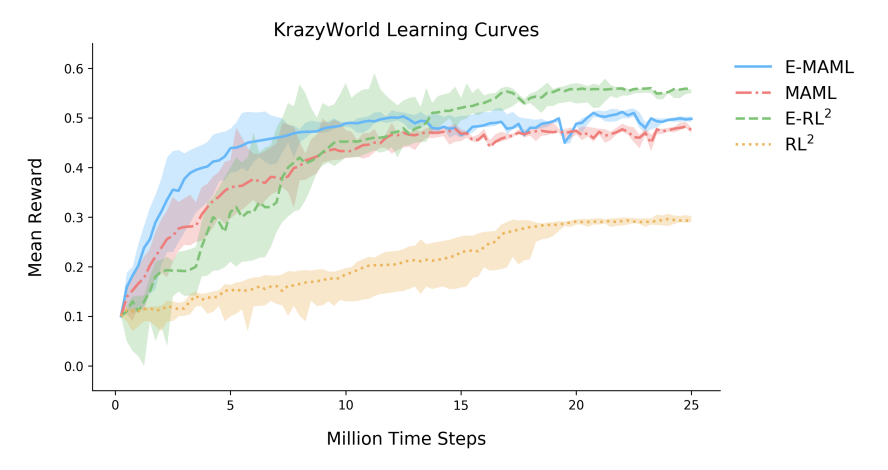

# RL^2: Fast Reinforcement Learning via Slow Reinforcement Learning

Hi! We're going to make a simple RNN meta-learner, which can adapt to new multi-arm bandit problems! Eventually, we'll be able to make it solve different kinds of problems!

* RL snakes
* Video games
* ..etc

## Notes
See `trial_run.txt` for details. IS it actually improving?

* Does it simply need to run for longer?
* Right now, the hidden state is reset after 3 episodes. Should we do something else here? Batch?
* Any other things?
